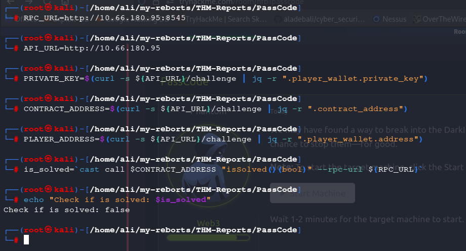
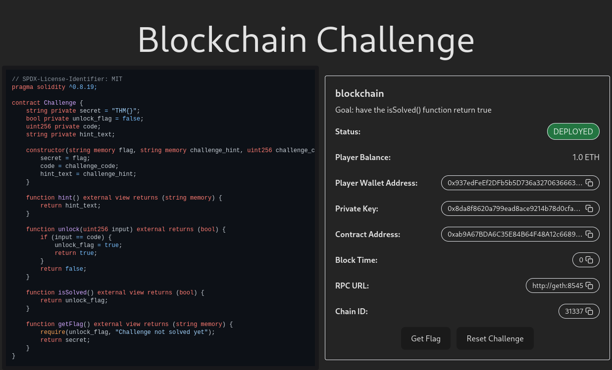
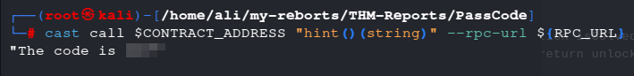
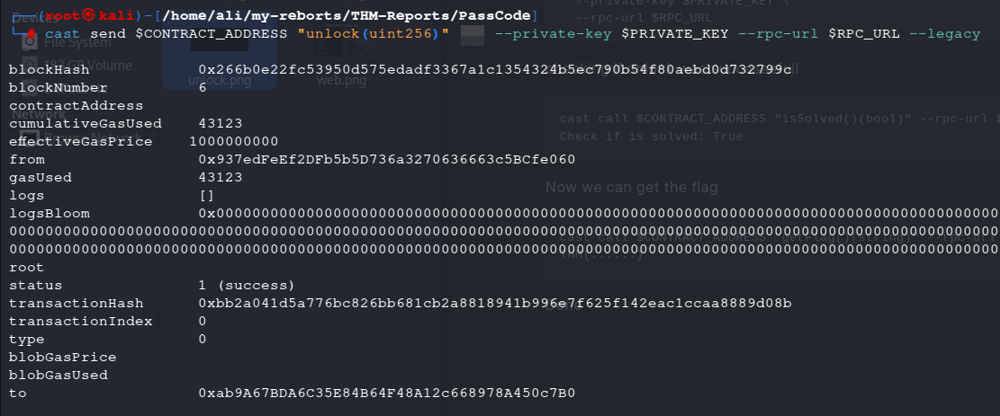
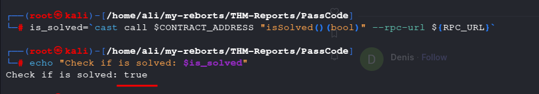
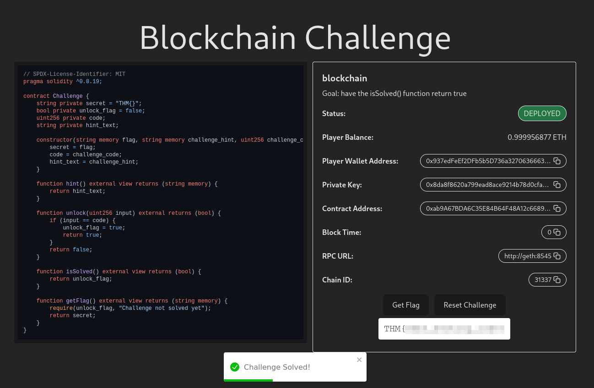

#          TryHackMe__PassCode__writeup 

## Room Overview

This room is classified as an easy-level challenge under the Blockchain / Web3 category.
The objective is straightforward, focusing on interacting with a smart contract to retrieve a single passcode. 
The room is short, clear, and can be completed in a minimal amount of time.


---

## Execution Overview

To begin the challenge, we must first execute all the commands provided in the room exactly as given and in the correct order. These commands are required to initialize the environment, retrieve the necessary values, and interact correctly with the deployed smart contract. Executing them properly allows us to check the contract state and confirm whether the challenge has been solved.


>`RPC_URL=http://10.66.180.95:8545`

>`API_URL=http://10.66.180.95`

>`PRIVATE_KEY=$(curl -s ${API_URL}/challenge | jq -r ".player_wallet.private_key")`

>`CONTRACT_ADDRESS=$(curl -s ${API_URL}/challenge | jq -r ".contract_address")`

>`PLAYER_ADDRESS=$(curl -s ${API_URL}/challenge | jq -r ".player_wallet.address")`

>``` is_solved=`cast call $CONTRACT_ADDRESS "isSolved()(bool)" --rpc-url ${RPC_URL}` ```

>`echo "Check if is solved: $is_solved"`


### ⚠️ Important Note (Local Machine / VPN Users)

If you are running this challenge on your own machine (instead of the TryHackMe AttackBox) or if you are connected via VPN, please note that the cast tool is not installed by default. The cast command is part of Foundry, which must be installed manually before executing the room commands.

Foundry installation commands:

>`cd ~`

>`curl -L https://foundry.paradigm.xyz | bash`

>`source ~/.zshenv`   # or open a new terminal

>`foundryup`

After installation, verify that the tool is available:

>`cast --version`

Once cast is successfully installed, you can proceed to run the room-provided commands normally.





Here we receive an fales, and if we go to the website at http://<MACHINE_IP>




we cannot obtain the flag.

Now, as you can see in the script on the website, we need to obtain the hint by using the following command. 


>`cast call $CONTRACT_ADDRESS "hint()(string)" --rpc-url ${RPC_URL}`





Now that we have teh code, we can call unlock with the code. 
through the following command.

>`cast send $CONTRACT_ADDRESS "unlock(uint256)" 333 --private-key $PRIVATE_KEY --rpc-url $RPC_URL --legacy`





Now if we go back to using the lest two commands that was given to us at the beginning of the room, we will get a different result.




 Now we got a true we can go to the website and get the flag by clicking on  **~get flag~** button.





If this report helped you understand teh challenge or solve it more efficiently. I'm glad it was useful. 

Think you for taking the time to read it.


